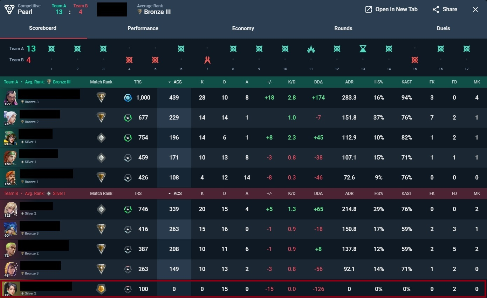

# SageBot v1.0

SageBot is a lightweight utility written in C, designed to prevent being disconnected for inactivity (AFK) in VALORANT.

## How to use?
1. [Download here.](https://github.com/18mzu/sagebot/releases/tag/release)
2. Run sagebot.exe
3. Activate and AFK

## FaQs

Q: Can I get banned for using this stupid tool?
 
A: Using .exe that trigger actions in the game is bannable (Yes, Vanguard does read this .exe) but SageBot works in a completely random patterns, therefore the security of your account is guaranteed.

HOWEVER, you are responsible for the actions taken on your account. It is your responsibility if you get banned for using this.
