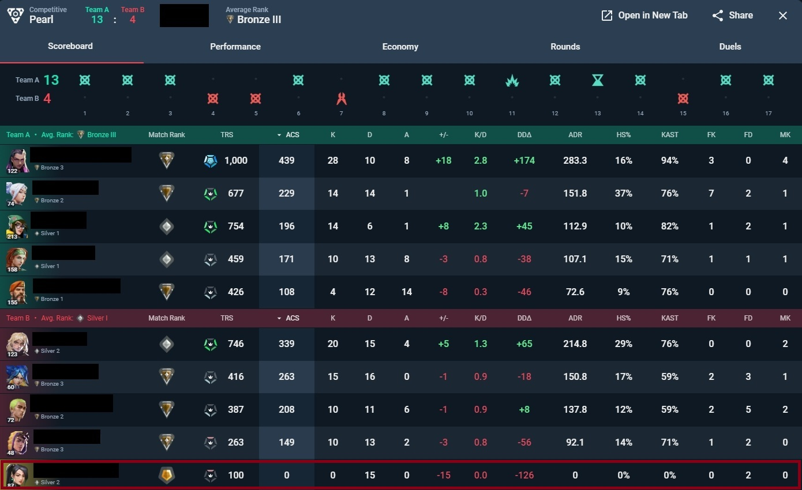

# SageBot

SageBot is an external, multi-purpose, anti-afk tool for VALORANT.

## How to use?
1. [Download here.](https://github.com/18mzu/sagebot/releases)
2. Run sagebot.exe

Notes:
 - This is just a very fun project that I made to use personally. I have never gotten banned using this before.
 - This is not, and will never give you any advantages in gaming (only disadvantages to your team) so do not worry.

ts also getting 3 flags on VirusTotal (AS OF v2.4) but i assure you this is safe.
